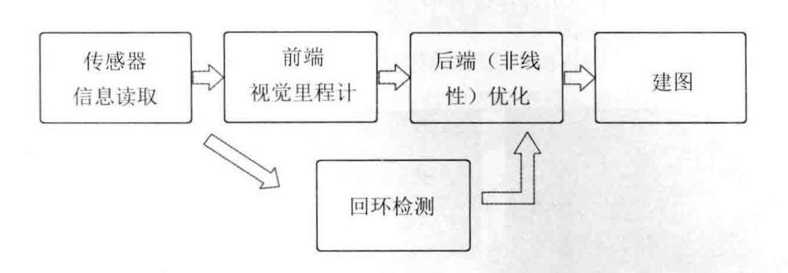

# 初识 SLAM

## 引言

SLAM 是 Simulataneout Localization and Mapping 的缩写，中文译作 “**同时定位与地图构建**“
他是搭建**特定传感器**的主体，在没有**环境先验信息**的情况下，与**运动过程中**建立**环境**的模型，同时估计自己的**运动**。
要想机器人有自主移动的能力，并且进行只有探索，首先它需要知道两件事：

1. 机器人在什么地方？——定位
2. 周围环境是什对么样的？——建图

就相当于机器人需要了解自身的状态（即位置），另一方面也需要了解外在的环境（即地图）。

视觉 SLAM 主要是通过**相机**来解决定位和建图问题，根据工作方式的不同，相机主要分为单目（Monocular）、双目（Stereo）和深度（RGB-D）三大类。

### 单目相机

只使用一个摄像头进行 SLAM 的做法被称为单目 SLAM ， 它使用二维的形式来记录三维的世界。

- pros: 成本低廉
- cons: 尺度不确定性（无法确定物体的真实尺度），平移之后才能计算依靠视差（近处的物体移动快，远处的物体移动慢，极远处几乎不动）来计算深度。
- 缺点的根本原因就是单张图像无法确定深度。

### 双目相机和深度相机

双目相机两个相机之的距离被称之为基线，可以通过基线估算出每个像素的空间位置。
深度相机又被称为 RGB-D 主要使用传感器比如说红外线结构光或者是 Time-of-Flight 原理来估测出物体与相机之间的距离。

- pros：可以依靠单张图像确定距离
- 双目相机 cons：需要大量的计算才能估计每一个像素点的深度，通常还需要 GPU 和 FPGA 设备进行加速。因此在现有的条件下，**计算量**是双目相机的瓶颈。
- 深度相机 cons：虽然相比双目相机要节省计算资源，但是RGB相机具有测量距离窄、噪声大、视野小、易受日光干扰、无法测量投射材质等诸多问题，主要用于室内，室外难以应用。

## 视觉 SLAM 框架的组成部分

整个视觉 SLAM 流程包括以下步骤。

1. **传感器信息读取**。在视觉 SLAM 中主要为相机图像信息的读取和预处理。如果在机器人中，还可能有码盘、惯性传感器等信息的读取和同步。
2. **前端视觉里程计（Visual Odometry, VO）**。 视觉里程计的任务是估算相邻图像间相机的运动，以及局部地图的样子。VO被称为**前端**。
3. **后端（非线性）优化（Optimization）**。后端接受不同时刻视觉里程计测量的相机位姿，以及回环检测的信息，对他们进行优化，得到全局一致的轨迹和地图。由于接在 VO 之后，又被称为**后端**。
4. **回环检测（Loop Closure Detection）**回环检测判断机器人是否到达过先前的位置。如果检查到回环，它会把信息提供给后端进行处理。
5. **建图（Mapping）**。他根据估计的轨迹，建立于任务要求对应的地图。

### Visual Odometry 视觉里程计

视觉里程计关心**相邻图像**之间的相机运动，最简单的情况当然是两张图像之间的运动关系。
这一部分主要关心的问题就是计算机如何通过图像来确定相机的运动，比如说旋转了多少度，平移了多少米。
目前可以通过相机与空间点的几何关系来知道这些东西，这些数学知识应该后面会讲到。
现在就是需要了解，视觉里程计就是能够通过相邻帧间的图像估计相机运动，并恢复场景的空间结构。
视觉里程计只计算相邻时刻的运动，这里的相邻时刻可以为 2-10 帧。
如果只是 通过视觉里程计来估计轨迹，将不可避免地出现**累计漂移（Accumulating Drift）**。
为了解决视觉里程计出现的漂移就需要通过后端优化和回环检测来解决。回环检测负责把“机器人回到原来位置”的事情检测出来，而后端优化这根据该信息，校正整个轨迹的形状。

### Optimization 后端优化

后端优化主要处理 SLAM 过程中的**噪声**问题。显而易见，传感器肯定有误差的，在不同环境下误差可能还不一样，而这是传感器产生的误差就是后端优化所要解决的问题。
在视觉 SLAM 中，前端和计算机数据而研究领域更为相关，比如图像的特征提取与匹配等，后端主要是滤波和非线性优化算法。SLAM 问题的本质就是：对运动主体自身和周围环境空间不确定性的估计。在后端优化中，我们主要需要学习状态估计和非线性优化知识。

### Loop Closure 回环检测

回环检测也是为了解决位置估计随着时间漂移的问题。主要目的是让机器人知道自己回到了原点，让机器人具有识别到过场景的能力。回环检测实际上是一种检测图像相似性的算法。
在检测到回环后，算法会把“ A 和 B 是同一点“的信息告诉给后端优化算法，并以此减少累计误差，得到全局一致的估计和地图。

### Mapping 地图构建

地图的形式根据 SLAM 的应用场景而不同，大体来讲，可以分为度量地图（Metric Map）和拓扑地图（Topological Map）两种。
度量地图强调精确地表示地图中物体的位置关系，通常用稀疏和稠密对其分类。
稀疏地图进行了一定程度的抽象，并不需要表达所有的物体，着重于建模所有看到的东西。定位时，用稀疏地图就足够了。
而导航就需要稠密地图了。

拓扑地图，更强调地图元素之间的关系。拓扑地图是一个图（数据结构里面的图），有边和节点组成，只考虑节点间的连通性。

## SLAM 问题的数学表述

在连续的离散时刻 $t=1,\dots,K$ 当中发生的事情，在这些时刻中 $\boldsymbol{x}$ 机器人的位置在各时刻就记为$\boldsymbol{x_1},\dots,\boldsymbol{x_K}$，它构成了机器人的轨迹。
地图方面，假设地图由许多个路标组成的，在每个时刻，传感器会测量到一部分路标点，得到他们的观察数据。假设路标一共有 $N$ 个，使用 $\boldsymbol{y_1},\dots,\boldsymbol{y_N}$表示。

机器人带着传感器移动需要使用如下两种事情描述：

1. 什么是**运动**？主要考察 $k-1$ 到 $k$ 时刻，机器人的位置 $\boldsymbol{x}$ 是如何变化的。
2. 什么是**观测**？假设在 $k$ 时刻与 $\boldsymbol{x}$ 处探测到了某一个路标 $\boldsymbol{y}_j$，我们要考虑如果使用数学语言来描述这件事情。

首先，引入一个通用的、抽象的运动方程：
$$
\boldsymbol{x_k}=f(\boldsymbol{x}_{k-1},\boldsymbol{u}_k,\boldsymbol{w}_k)
$$
其中， $\boldsymbol{u}_k$ 就是运动传感器的读数或者输入， $\boldsymbol{w}_k$ 就是该过程中加入的噪声。
噪声的存在就使得模型变成的随机模型，即使 $\boldsymbol{u}_k$ 的输入为前进 1 米，但是由于噪声的存在，不代表机器人真的前进了一米。

与运动方程对应的还有一个观测方程，假设机器人在 $\boldsymbol{x}_k$ 看到某一个路标点 $\boldsymbol{y}_j$，产生了一个观测数据 $\boldsymbol{z}_{k,j}$，可以被下面的抽象函数 $h$ 描述这个关系。
$$
\boldsymbol{z}_{k,j}=h(\boldsymbol{y}_j,\boldsymbol{x}_k,\boldsymbol{v}_{k,j})
$$
$v_{k,j}$ 是观测里面的噪声。由于观测的传感器形式很多，所以这里的形式也有许多不同。

上面只是给出了两个抽象的公式，具体 $\boldsymbol{x,y,z}$ 是什么却没有给出，其实根据传感器的种类不同，存在若干的参数化（Parameterization）方法。具体方面，还是看了后面具体章节在研究。
虽然运动方程和观测方程，依据不同的参数化方法会具有不同的形式，但是基本上可以总结为以下两个基本方程：
$$
\begin{cases}\boldsymbol{x}_{k}=f\left(\boldsymbol{x}_{k-1}, \boldsymbol{u}_{k}, \boldsymbol{w}_{k}\right), & k=1, \cdots, K \\ \boldsymbol{z}_{k, j}=h\left(\boldsymbol{y}_{j}, \boldsymbol{x}_{k}, \boldsymbol{v}_{k, j}\right), & (k, j) \in \mathcal{O}\end{cases}
$$

这两个方程据称了最基本的 SLAM 问题：当知道运动测量的读书 $\boldsymbol{u}$和传感器读读数 $\boldsymbol{z}$ 时，
该如何求解问题（估计 $\boldsymbol{x}$）和建图问题（估计 $\boldsymbol{y}$）。
这时，就会把 SLAM 问题建模成一个**状态估计**问题：如何通过带有噪声的测量数据，估计内部的、隐藏着的状态变量？

状态估计问题的求解，与上面两个方程的具体形式，以及在噪声服从那种分布有关。按照运动和观测方程是否线性，噪声是否服从高斯分布进行分类，分为**线性/非线性和高斯/非高斯**系统。
其中线性高斯系统是最简单的，可以直接使用卡尔曼滤波器求出无偏的最优估计。对于复杂的非线性非高斯系统，会使用扩展卡尔曼滤波器（Extended Kalman Filter,EKF）和非线性优化两大类方法去求解。

最早的时候， SLAM 系统一般采用 EKF 为主的滤波器方法。但是 EKF 的缺点（例如线性化误差和噪声高斯分布假设），粒子滤波器（Particle Filter）等滤波器。现在，主流视觉 SLAM 使用以图优化（Graph Optimization） 为代表的优化技术进行状态估计。
